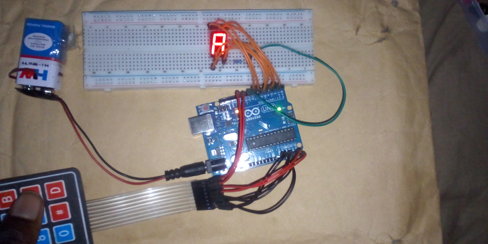

# Keypad-Controlled 7-Segment Display System – Arduino Project

## Overview
This project demonstrates how to interface a 4×4 keypad with a 7-segment display using Arduino. Each key pressed on the keypad is detected and the corresponding number or character is displayed on the 7-segment display in real time.

## Objective
- Learn how to interface a 4×4 keypad with Arduino
- Read and process keypad input using the Keypad library
- Display numeric and alphanumeric characters on a 7-segment display
- Understand keypad matrix scanning and key mapping
- Use serial output for debugging and monitoring input

## Components Used
- Arduino Uno
- 4×4 Matrix Keypad
- 1-Digit 7-Segment Display
- 220Ω resistors
- Breadboard
- Jumper wires
- 9V Battery
- 9V Battery Clip to DC Barrel Jack

## Circuit Diagram

[CLICK HERE FOR OTHER IMAGES](images/)

## How It Works
1. The 4×4 keypad is connected to the Arduino using row and column pins.
2. The Keypad library scans the matrix to detect which key is pressed.
3. When a key is pressed, its ASCII value is captured and processed.
4. Each key is mapped to a specific number or character.
5. The Arduino activates the correct segments on the 7-segment display to show:
   - Numbers (0–9)
   - Letters (A–D)
   - Special symbols (* and #)
6. The pressed key and corresponding value are printed to the Serial Monitor.

## Code
The Arduino sketch for this project is located in the [code/ directory](code/keypad_seven_segment_display_project_on_6th_november_2025.ino).

## Demo Video
A demonstration video showing the working project is included in this repository.

📹 **Project Demonstration:**  
[Click here to watch/download the demo video](https://youtu.be/LY2zE51rwgk)

*(If the video does not preview directly on GitHub, please download it using the link above.)*

## Reflection (What I Learned)
- How keypad matrix scanning works
- Using external libraries in Arduino projects
- Mapping keypad input to display outputs
- Displaying alphanumeric characters on a 7-segment display

## Challenges Faced
- Correctly mapping keypad keys to display values
- Managing ASCII values from keypad input
- Wiring multiple pins cleanly and correctly

## Possible Improvements
- Add support for multi-digit displays
- Implement input buffering for keypad sequences
- Display keypad input on an LCD or OLED screen

## Project Status
Completed
